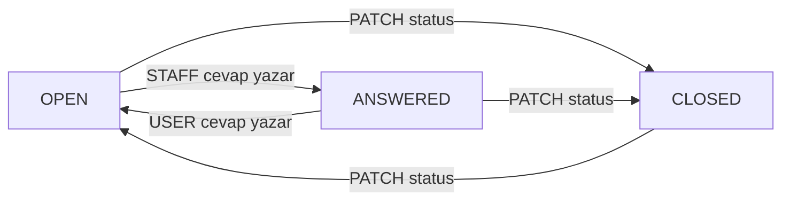

# support-lib

[](https://jitpack.io/#Furkanaksu/support-lib)

Ktor + Exposed tabanlı, **yeniden kullanılabilir support (destek talebi) kütüphanesi**.
Bir kez yazılır, GitHub'a konur, her yeni projede bağımlılık olarak eklenip iki satırla çağrılır.

Altyapı `furkan.api` ile aynıdır: Gradle Kotlin DSL + version catalog, JDK 21, Kotlin 2.2.21,
Ktor 3.3.2, Exposed 0.61.0, kotlinx.serialization.

## Kritik tasarım kuralları

1. **DB kütüphane içinde `connect` edilmez.** Dışarıdan `Database` objesi alınır, her sorgu
   `transaction(database)` ile çalışır.
2. **Path sabit yazılmaz.** `basePath` parametriktir — `/support`, `/api/v2/destek` fark etmez.
3. **Her şey config'le enjekte edilir.** DB, path, tablo adı, auth hep `SupportConfig`'ten gelir;
   kütüphane hiçbir ortama özel şey bilmez.

## Kurulum (tüketen proje)

`settings.gradle.kts`:

```kotlin
dependencyResolutionManagement {
    repositories {
        mavenCentral()
        maven("https://jitpack.io")
    }
}
```

`build.gradle.kts`:

```kotlin
dependencies {
    implementation("com.github.Furkanaksu:support-lib:1.1.0")
}
```

## Kullanım

```kotlin
fun Application.module() {
    // Bu projenin KENDİ veritabanı
    val db = Database.connect(
        url = "jdbc:postgresql://localhost:5432/proje_a_db",
        driver = "org.postgresql.Driver",
        user = System.getenv("DB_USER"),
        password = System.getenv("DB_PASSWORD")
    )

    val supportConfig = SupportConfig(
        database = db,
        basePath = "/api/destek",        // base link bu projede farklı olabilir
        tableName = "prayapp_support"    // tablo adı da projeye özel
    )
    supportConfig.migrate()              // tabloyu bu DB'de oluştur

    install(ContentNegotiation) { json() }   // tüketen projenin sorumluluğu

    routing {
        supportRoutes(supportConfig)     // hazır
    }
}
```

Auth istenirse, projenin kendi Authentication kurulumu kullanılır:

```kotlin
SupportConfig(database = db, requireAuth = true, authName = "auth-jwt")
```

## Uç noktalar

`basePath` varsayılanı `/support`:

| Metot | Yol | Açıklama |
| --- | --- | --- |
| GET | `{basePath}` | Sayfalı liste — `page`, `size`, `email`, `deviceId`, `status` |
| POST | `{basePath}` | Yeni talep — `deviceId`, `email`, `description` zorunlu |
| GET | `{basePath}/device/{deviceId}` | Kullanıcının kendi talepleri — durum ve cevap sayısıyla |
| GET | `{basePath}/{id}` | Detay: talep + tüm cevaplar |
| POST | `{basePath}/{id}/replies` | Cevap yaz — `message` zorunlu, `author` opsiyonel |
| PATCH | `{basePath}/{id}/status` | Durum değiştir — `OPEN`, `ANSWERED`, `CLOSED` |
| DELETE | `{basePath}/{id}` | Talebi sil (cevapları da silinir) |

`POST {basePath}` gövdesi:

```json
{
  "deviceId": "device-1",
  "email": "a@b.com",
  "description": "Uygulamada hata alıyorum",
  "location": "Istanbul",
  "latitude": 41.0,
  "longitude": 29.0
}
```

Koordinatlar hem sayı hem tırnaklı string kabul edilir (`41.0` veya `"41.0"`), böylece
gövdeyi string map olarak gönderen eski istemciler de çalışır.

## Durumlar ve cevaplama

Her talebin bir durumu vardır ve durum cevaplarla birlikte otomatik ilerler:

| Durum | Anlamı |
| --- | --- |
| `OPEN` | Yeni açıldı ya da son sözü kullanıcı söyledi — ekip cevabı bekleniyor |
| `ANSWERED` | Son cevabı destek ekibi yazdı |
| `CLOSED` | Kapatıldı (sadece `PATCH .../status` ile) |



Cevap gövdesi — `author` verilmezse `STAFF` kabul edilir:

```json
{ "message": "Konuyu inceledik, güncellemede düzeltilecek.", "author": "STAFF" }
```

`GET {basePath}/{id}` cevabı, talebin tüm yazışmasını zaman sırasıyla döner:

```json
{
  "id": 12,
  "deviceId": "device-1",
  "status": "ANSWERED",
  "description": "Uygulamada hata alıyorum",
  "createdDate": "2026-09-20T12:00:00",
  "updatedDate": "2026-09-20T12:30:00",
  "replies": [
    { "id": 3, "supportId": 12, "message": "Konuyu inceledik.", "author": "STAFF", "createdDate": "2026-09-20T12:30:00" }
  ]
}
```

`GET {basePath}/device/{deviceId}` kullanıcının kendi taleplerini döner — `deviceId` tam eşleşir,
her satırda `status` ve `replyCount` bulunur, `?status=OPEN` ile filtrelenebilir.

## Tablolar

Kütüphane iki tablo kullanır: `tableName` (talepler) ve `replyTableName` (cevaplar, varsayılan
`<tableName>_replies`). Cevap tablosu talebe `ON DELETE CASCADE` ile bağlıdır.
`migrate()` ikisini de oluşturur; var olan tabloya eksik kolonları ekler.

## Yayınlama (JitPack)

```bash
git tag 1.1.0
git push origin 1.1.0
```

Tag atıldıktan sonra JitPack ilk istekte derler. JDK 21 için repo kökündeki `jitpack.yml` kullanılır.

Yerelde denemek için:

```bash
./gradlew publishToMavenLocal
```

Tüketen projenin `repositories` bloğuna `mavenLocal()` eklemen yeterli.

## Geliştirme

```bash
./gradlew build
```
